# Payment Flow Analysis

## Overview
This document analyzes the fan-to-creator payment process, identifying the current implementation and its shortcomings.

## Payment Flow Diagram

```mermaid
sequenceDiagram
    participant F as Frontend
    participant API as Backend API
    participant DB as Database
    participant RC as Redis Cache
    participant YT as YouTube API
    participant TG as Telegram
    participant PP as PawaPay API
    participant WS as WebSocket
    participant Email as Email Service

    Note over F,Email: PHASE 1: DISCOVERY (GET /fan/:channelHandle)
    F->>API: GET /fan/:channelHandle?limit=5

    rect rgb(240, 248, 255)
        Note over API,DB: Step 1: Channel Validation
        API->>DB: Find channel by handle (case-insensitive)
        alt Channel Not Found
            API-->>F: 404 Not Found
        end
    end

    rect rgb(240, 248, 255)
        Note over API,YT: Step 2: YouTube Content Lookup
        API->>DB: Find YouTubeChannel for creator
        API->>RC: Check YouTube cache (5-min TTL)
        alt Cache Miss
            API->>YT: Get live stream or latest video
            YT-->>API: Video info (embed URL, title, thumbnail)
            API->>RC: Cache result
        else Cache Hit
            RC-->>API: Cached video info
        end
    end

    rect rgb(240, 248, 255)
        Note over API,TG: Step 3: Recent Messages
        API->>RC: Check messages cache (1-min TTL)
        alt Cache Miss
            API->>TG: Fetch recent channel messages
            TG-->>API: Messages (text-only, creator/fan identified)
            API->>RC: Cache messages
        else Cache Hit
            RC-->>API: Cached messages
        end
    end

    rect rgb(240, 248, 255)
        Note over API,TG: Step 4: Verify Channel Access
        API->>TG: Check bot can access channel
        API->>TG: Get channel admins
        TG-->>API: Admin list
        API->>API: Verify ≥2 admins (bot + creator)
        Note right of API: Sets paymentsAvailable = true/false
    end

    rect rgb(240, 248, 255)
        Note over API,TG: Step 5: Fan Invite Link (Self-Healing)
        alt Link exists in DB
            API->>DB: Get stored link
            API->>TG: Validate link still active
            alt Link expired/used
                API->>TG: Revoke old link
                API->>TG: Generate new unlimited link
                TG-->>API: New invite link
                API->>DB: Update fanInviteLink
            end
        else No link exists
            API->>TG: Generate unlimited invite link
            TG-->>API: Invite link
            API->>DB: Store fanInviteLink
        end
    end

    rect rgb(240, 248, 255)
        Note over API,PP: Step 6: Payment Options
        API->>RC: Check payment-countries cache (5-min TTL)
        alt Cache Miss
            API->>PP: Get operator availability
            PP-->>API: Status per operator (OPERATIONAL/DELAYED/CLOSED)
            API->>DB: Get currency prices
            API->>API: Group by country, filter CLOSED
            API->>API: Calculate min/max/multiples per operator
            API->>RC: Cache result
        else Cache Hit
            RC-->>API: Cached payment options
        end
    end

    API-->>F: 200 OK {channelHandle, youtubeEmbed, messages,<br/>paymentsAvailable, inviteLink, paymentCountries}

    Note over F,Email: PHASE 2: PAYMENT INITIATION (POST /fan/:channelHandle/payment)
    F->>API: Payment request (operator, amount, message, etc.)

    rect rgb(255, 250, 240)
        Note over API,DB: Steps 1-2: Validation
        API->>DB: Find channel (coAdminAdded=true)
        alt Channel not ready
            API-->>F: 404 Not Found
        end
        API->>TG: Verify bot can still access channel
        alt Channel unavailable
            API-->>F: 400 Channel Unavailable
        end
    end

    rect rgb(255, 250, 240)
        Note over API,DB: Steps 3-5: Amount Calculation
        API->>API: Generate depositId, fanSessionId (UUIDs)
        API->>DB: Find currency, verify price configured
        API->>API: Calculate amount = currency.price × priceMultiple
    end

    rect rgb(255, 250, 240)
        Note over API,PP: Step 6: Operator Validation
        API->>PP: Check operator availability (cached)
        API->>API: Validate amount vs operator limits
        alt Validation fails
            API-->>F: 400 Bad Request (detailed error)
        end
    end

    rect rgb(255, 250, 240)
        Note over API,DB: Steps 7-9: Create Transaction
        API->>API: Auto-lookup country from operator
        API->>DB: Get "pending" status
        API->>DB: Create transaction record<br/>(payment info, fan info, referral tracking)
    end

    rect rgb(255, 250, 240)
        Note over API,PP: Step 10: PawaPay Deposit (with retry)
        API->>PP: executeWithRetry(createDeposit)<br/>(3 attempts: 1s, 5s, 15s backoff)
        alt Transient error (network, 5xx)
            PP-->>API: Error (retryable)
            API->>API: Retry attempt 2
            API->>PP: createDeposit (retry)
        end
        alt PawaPay rejects (REJECTED, validation)
            PP-->>API: Rejection (non-retryable)
            API->>DB: Mark transaction FAILED
            API-->>F: 500 Error
        else PawaPay succeeds (ACCEPTED)
            PP-->>API: Deposit initiated
        end
    end

    API-->>F: 201 Created {fanSessionId, depositId, status: "pending"}

    Note over F,Email: PHASE 3: WEBSOCKET CONNECTION
    F->>WS: Connect to /fan namespace
    WS-->>F: Connection established
    F->>WS: joinFanRoom(fanSessionId)
    WS->>WS: Create room: fan:${fanSessionId}
    WS-->>F: roomJoined confirmation

    Note over F,Email: PHASE 4: PAYMENT PROCESSING
    Note over PP: User receives mobile money prompt
    Note over PP: User approves/rejects on phone
    PP->>PP: Process payment

    Note over F,Email: PHASE 5: WEBHOOK CALLBACK (POST /pawapay/callback)
    PP->>API: Webhook: payment status update

    rect rgb(240, 255, 240)
        Note over API: Step 1: Validate RFC-9421 Signature
        API->>API: Extract 5 required headers<br/>(signature, signature-input, signature-date,<br/>content-digest, content-type)
        API->>API: Verify content digest (SHA-256/SHA-512)
        API->>API: Parse signature input<br/>(algorithm, keyid, created/expires)
        API->>API: Validate signature age<br/>(10-min max, 60s clock skew)
        API->>RC: Fetch public key by keyid<br/>(1-hour cache, pre-warmed on startup)
        alt Cache miss
            API->>PP: GET /public-key/http
            PP-->>API: Public keys array
            API->>RC: Cache keys
        end
        API->>API: Build RFC-9421 signature base<br/>(@method, @authority, @path, headers)
        API->>API: Verify ECDSA (p256-sha256) signature
        alt Invalid signature or expired
            API-->>PP: 401 Unauthorized
        end
    end

    rect rgb(240, 255, 240)
        Note over API: Step 2: Route by Callback Type
        API->>API: Discriminate callback type
        alt isDepositCallback
            Note right of API: → processDepositCallback()
        else isPayoutCallback
            Note right of API: → processPayoutCallback()
        else isRefundCallback
            Note right of API: → processRefundCallback()
        end
    end

    rect rgb(240, 255, 240)
        Note over API,DB: Steps 3-5: Idempotency Check (Deposit)
        API->>API: Extract depositId from webhook
        API->>DB: START TRANSACTION + LOCK (pessimistic_write)
        API->>DB: Find transaction by depositId
        alt Already processed (succeeded/failed)
            API->>DB: COMMIT
            API-->>PP: 200 OK (already handled)
        end
    end

    rect rgb(240, 255, 240)
        Note over API,DB: Steps 5-6: Update Status
        API->>API: Map PawaPay status → internal status
        API->>DB: Update transaction status + timestamp
        API->>DB: COMMIT TRANSACTION
    end

    rect rgb(240, 255, 240)
        Note over API,WS: Step 7: Notify Fan
        API->>WS: Emit paymentStatus to fan:${fanSessionId}
        WS-->>F: Payment status update
    end

    alt Payment Succeeded
        rect rgb(240, 255, 240)
            Note over API,TG: Step 8: Trigger Message Delivery (Async)
            API->>API: Start deliverFanMessageWithRetry (non-blocking)
            API-->>PP: 200 OK (webhook processed)
        end

        Note over F,Email: PHASE 6: MESSAGE DELIVERY
        rect rgb(255, 240, 240)
            Note over API,TG: Attempt 1 (immediate)
            API->>API: Get channel from beneficiary
            API->>API: Format message for Telegram
            API->>TG: Send message to channel
            alt Success
                TG-->>API: Message posted (messageId)
                API->>DB: Update: messageDeliveryStatus=delivered,<br/>messageId, deliveredAt, attempts=1
                API->>WS: Emit messageDelivery: delivered
                WS-->>F: Message delivered ✓
            else Failure
                TG-->>API: Error
                API->>DB: Update attempts=1, error
                API->>API: Wait 1 second
            end
        end

        rect rgb(255, 240, 240)
            Note over API,TG: Attempt 2 (after 1s)
            API->>TG: Send message to channel
            alt Success
                TG-->>API: Message posted (messageId)
                API->>DB: Update: delivered, attempts=2
                API->>WS: Emit messageDelivery: delivered
                WS-->>F: Message delivered ✓
            else Failure
                TG-->>API: Error
                API->>DB: Update attempts=2, error
                API->>API: Wait 5 seconds
            end
        end

        rect rgb(255, 240, 240)
            Note over API,TG: Attempt 3 (after 5s more)
            API->>TG: Send message to channel
            alt Success
                TG-->>API: Message posted (messageId)
                API->>DB: Update: delivered, attempts=3
                API->>WS: Emit messageDelivery: delivered
                WS-->>F: Message delivered ✓
            else Final Failure (all attempts exhausted)
                TG-->>API: Error
                API->>DB: Update: messageDeliveryStatus=failed

                Note over API,Email: Enhanced Failure Handling with Retry
                API->>API: Generate unique refundId (UUID)
                API->>DB: Update: pawapayRefundId, pawapayRefundStatus=processing
                API->>PP: executeWithRetry(createRefund)<br/>(depositId, amount, reason, metadata)<br/>(3 attempts: 1s, 5s, 15s backoff)

                alt Refund accepted (ACCEPTED)
                    PP-->>API: Refund initiated
                    API->>DB: Update: pawapayRefundStatus=processing
                else Refund rejected (REJECTED)
                    PP-->>API: PawapayRejectionException
                    API->>DB: Update: pawapayRefundStatus=failed
                    Note right of API: Log rejection reason
                else Duplicate refund (DUPLICATE_IGNORED)
                    PP-->>API: PawapayDuplicateException
                    Note right of API: Keep status=processing<br/>(original still pending)
                else Transient error (after 3 attempts)
                    PP-->>API: PawapayTransientException
                    API->>DB: Update: pawapayRefundStatus=failed
                    Note right of API: Manual intervention needed
                end

                API->>Email: Send management alert<br/>(transaction details, error, refund status,<br/>delivery attempts, last error message)
                Email-->>API: Email sent

                API->>WS: Emit messageDelivery: failed<br/>(refunded=true/false, refundStatus)
                WS-->>F: Refund status notification
            end
        end

    else Payment Failed
        rect rgb(240, 255, 240)
            Note over API,WS: Step 9: Notify Failure
            API->>WS: Emit paymentStatus: failed (with reason)
            WS-->>F: Payment failed
            API-->>PP: 200 OK
        end
    end
```

## Current Implementation

### Key Components

| Component | Endpoint/File | Responsibility |
|-----------|--------------|----------------|
| **Discovery** | `GET /fan/:channelHandle` | Multi-step channel info aggregation |
| **Initiation** | `POST /fan/:channelHandle/payment` | Validate, create transaction, initiate PawaPay deposit |
| **Webhook** | `POST /pawapay/callback` | Process PawaPay status updates |
| **Message Delivery** | `TelegramService.deliverFanMessageWithRetry()` | Deliver message with 3 retry attempts |
| **WebSocket** | `FanGateway` | Real-time status notifications |

### Flow Summary

The complete payment flow consists of **6 phases** as shown in the diagram above:

1. **Discovery** - Fan visits landing page, backend aggregates all channel info
2. **Payment Initiation** - Fan submits payment, backend validates and creates transaction
3. **WebSocket Connection** - Fan connects to receive real-time updates
4. **Payment Processing** - User approves payment on their phone
5. **Webhook Callback** - PawaPay notifies backend of payment status
6. **Message Delivery** - Backend posts message to Telegram with retry logic and auto-refund on failure

**Timeline**: Typically completes in 30s - 2min from initiation to delivery

### Safeguards

- **Webhook Signature Verification**: RFC-9421 ECDSA signature validation with content digest, timestamp validation (10-min max age, 60s clock skew), and public key caching
- **Idempotency (webhook)**: Pessimistic write lock prevents duplicate processing
- **Retry Logic (PawaPay API)**: 3 attempts with exponential backoff (1s, 5s, 15s) for deposits, payouts, and refunds
- **Retry Logic (message delivery)**: 3 attempts with exponential backoff (1s, 5s, 15s)
- **Automatic Refunds**: Initiated with retry logic if message delivery fails after all attempts; tracks refund status and handles duplicate/rejection gracefully
- **Management Alerts**: Email notification on final failure with detailed error context, delivery attempts, and refund status
- **WebSocket Notifications**: Real-time status updates to frontend (payment, message delivery, refund status)
- **Structured Exception Handling**: Type-safe exceptions distinguish transient errors (retryable) from business rejections (permanent)

## Identified Shortcomings

### Critical Issues

#### 1. **No Queue System for Webhook Processing** - ⚠️ PARTIALLY ADDRESSED
- **Addressed**: Added immediate retry logic (3 attempts with 1s/5s/15s backoff) for PawaPay API calls (deposits, payouts, refunds)
- **Addressed**: Message delivery retry with auto-refund on failure (3 attempts)
- **Remaining**: Still no persistent queue for webhook processing itself
- **Problem**: If the process crashes during callback handling, webhook is lost (PawaPay does not retry callbacks)
- **Impact**: Edge case where payment succeeds but server crashes before processing webhook
- **Solution**: Still need message queue (BullMQ, RabbitMQ) for webhook ingestion with persistent retry and dead letter queues

#### 2. **No Payment Retry Mechanism for Users**
- **Problem**: If payment fails (insufficient funds, user cancels, timeout), user must create a new transaction from scratch
- **Impact**: Poor UX, lost conversions
- **Solution**:
  - Store pending transactions with expiry (15-30 min)
  - Allow retry with same transaction ID
  - Generate unique payment links that can be revisited

### High Priority Issues

#### 3. **No Webhook Timeout Handling**
- **Problem**: If webhook never arrives, transaction stays in PENDING state forever
- **Impact**: User paid but system doesn't know, manual intervention required
- **Solution**:
  - Background job to poll PawaPay API for pending transactions older than 10 minutes
  - Auto-timeout after 30 minutes with status polling

#### 4. **No Idempotency for Payment Initiation**
- **Problem**: User can double-click and create multiple transactions for same payment
- **Impact**: Multiple charges if user retries quickly
- **Solution**: Idempotency key based on (channelHandle, payerPhone, amount, timestamp window)

#### 5. **No Webhook Replay Attack Prevention** - ✅ RESOLVED
- **Solution Implemented**: RFC-9421 HTTP Message Signature verification with comprehensive timestamp validation
- **Controls**:
  - ECDSA p256-sha256 signature verification using public keys from PawaPay
  - 10-minute max signature age enforced (configurable)
  - 60-second clock skew tolerance to handle time differences
  - Content digest validation (SHA-256/SHA-512) prevents payload tampering
  - Public key rotation support via Redis cache (1-hour TTL, pre-warmed on startup)
  - Signature includes @method, @authority, @path, and critical headers
- **Remaining**: Consider adding rate limiting on callback endpoint for additional DoS protection

#### 6. **WebSocket Connection Loss = No Status Recovery**
- **Problem**: If WebSocket disconnects, user cannot recover payment status
- **Impact**: User doesn't know if payment succeeded
- **Solution**:
  - Add `GET /fan/payment/:fanSessionId/status` endpoint
  - Frontend polls as fallback if WebSocket disconnects

### Medium Priority Issues

#### 7. **Discovery Phase Performance Issues**
- **Problem**: Discovery phase makes 7 sequential steps with 4-5 external API calls (YouTube, Telegram x2-3, PawaPay)
- **Impact**: Slow page load (can take 2-5 seconds on cache miss), poor UX
- **Solution**:
  - Parallelize independent operations (YouTube + Messages + Payment Countries can run concurrently)
  - Increase cache TTLs for less critical data (messages: 1min → 2-5min)
  - Consider background jobs to warm caches
  - Add request timeout limits per external API

#### 8. **No Circuit Breaker for External Services**
- **Problem**: If PawaPay/Telegram APIs are down, system keeps hammering them
- **Impact**: Cascading failures, poor performance
- **Solution**: Implement circuit breaker pattern (Opossum, Polly)

#### 9. **No Compensation Logic if Refund Fails** - 🔄 IMPROVED
- **Addressed**: Retry logic for refund API calls (3 attempts with 1s/5s/15s backoff)
- **Addressed**: Graceful exception handling for different failure modes:
  - `PawapayRejectionException`: Marks refund as failed, logs rejection reason
  - `PawapayDuplicateException`: Keeps status as processing (original request still active)
  - `PawapayTransientException`: Retries, marks failed after exhausting attempts
- **Addressed**: Enhanced management alerts include:
  - Transaction details and original payment amount
  - Message delivery attempts and error history
  - Refund status and PawaPay refund ID
  - Actionable recommendations for manual intervention
- **Addressed**: Database tracks refund lifecycle (`pawapayRefundId`, `pawapayRefundStatus`)
- **Remaining**: Failed refunds still only logged after retry exhaustion, no persistent retry queue for long-term resolution
- **Solution**: Queue failed refunds for background retry job (hourly/daily) with exponential backoff

#### 10. **No Payment Expiry Mechanism**
- **Problem**: Pending transactions remain in DB indefinitely
- **Impact**: Database bloat, confusion in analytics
- **Solution**: Auto-expire transactions after 30 minutes, cleanup job for old PENDING records

#### 11. **No Dead Letter Queue**
- **Problem**: Failed webhook processing is lost
- **Impact**: No visibility into systematic failures
- **Solution**: Route failed webhooks to DLQ for manual inspection and replay

## Recommendations Priority

| Priority | Issue | Status | Effort | Impact | Notes |
|----------|-------|--------|--------|--------|-------|
| **P0** | Queue system for webhooks | ⚠️ Partial | High | Critical | Added retry logic for API calls; still need webhook ingestion queue |
| **P0** | Webhook timeout handling | ⏳ Open | Medium | Critical | No change - still needed |
| **P1** | Payment retry mechanism | ⏳ Open | High | High | No change - still needed |
| **P1** | Idempotency for payment initiation | ⏳ Open | Medium | High | No change - still needed |
| **P2** | Discovery phase parallelization | ⏳ Open | Medium | Medium | No change - still needed |
| **P2** | Status recovery endpoint | ⏳ Open | Low | Medium | No change - still needed |
| **P2** | Circuit breaker pattern | ⏳ Open | Medium | Medium | No change - still needed |
| **P2** | Webhook replay prevention | ✅ Done | Low | Medium | RFC-9421 signature verification with timestamp validation |
| **P2** | Refund failure compensation | 🔄 Improved | Low | Medium | Added retry logic and tracking; need persistent queue for long-term retry |
| **P3** | Payment expiry mechanism | ⏳ Open | Low | Low | No change - still needed |
| **P3** | Dead letter queue | ⏳ Open | Medium | Low | No change - still needed |

### Legend
- ✅ **Done**: Issue fully resolved
- 🔄 **Improved**: Partial solution implemented, some work remains
- ⚠️ **Partial**: Significant progress made, core issue partially addressed
- ⏳ **Open**: No progress yet, still needs implementation

## Additional Notes

### What Works Well
- **RFC-9421 signature verification**: Webhook authenticity validated with ECDSA signatures, content digest validation, and timestamp checking (10-min max age)
- **Public key caching**: Pre-warmed on startup, Redis-cached (1-hour TTL) to reduce API calls and improve performance
- **Retry logic for external APIs**: Consistent 3 attempts with exponential backoff (1s, 5s, 15s) for PawaPay calls (deposits, payouts, refunds)
- **Structured exception handling**: Type-safe exceptions for different failure modes (transient vs permanent):
  - `PawapayTransientException` - Retryable errors (network, 5xx)
  - `PawapayRejectionException` - Business rejections (no retry)
  - `PawapayDuplicateException` - Idempotent duplicate detection
  - `PawapayValidationException` - Pre-request validation
  - `PawapaySignatureException` - Invalid webhook signatures
- **Enhanced refund tracking**: Unique refund IDs (`pawapayRefundId`), lifecycle status tracking, duplicate detection, retry logic with graceful failure handling
- **Multi-layer caching strategy**: YouTube (5 min), Messages (1 min), Payment Countries (5 min), Providers (1 hour)
- **Message delivery retry logic**: 3 attempts with exponential backoff (1s, 5s, 15s)
- **Automatic refund on delivery failure**: Protects users when message can't be delivered, with detailed status tracking and management alerts
- **WebSocket real-time notifications**: Instant status updates to frontend (payment status, message delivery, refund status)
- **Pessimistic locking**: Prevents race conditions in webhook processing
- **Comprehensive validation**: Operator availability, amount limits, currency matching
- **Self-healing invite links**: Auto-regenerate expired Telegram links
- **Graceful degradation**: Failed API calls don't crash the endpoint (return null/empty arrays)
- **Callback type discrimination**: Separate processing paths for deposits, payouts, and refunds with type guards

### Error Handling Strategy

The payment system implements a sophisticated error classification and handling strategy:

#### Transient Errors (Automatic Retry)
- **Network failures**: Connection timeouts, DNS errors, connection refused
- **5xx Server errors**: PawaPay API temporary unavailability (500, 502, 503, 504)
- **Retry behavior**: 3 attempts with exponential backoff (1s, 5s, 15s)
- **Exception type**: `PawapayTransientException`
- **Applied to**: `createDeposit()`, `createPayout()`, `createRefund()`

#### Business Rejections (No Retry)
- **PawaPay REJECTED status**: Insufficient funds, invalid account, regulatory restrictions
- **Behavior**: Status mapped to internal "failed", user notified with reason
- **Exception type**: `PawapayRejectionException`
- **User impact**: Clear error message, opportunity to fix and retry payment

#### Validation Errors (No Retry)
- **4xx Client errors**: Invalid request format, missing required fields, schema validation
- **Behavior**: Fail fast, log error, alert if unexpected
- **Exception type**: `PawapayValidationException`
- **Prevention**: Pre-request validation at service layer

#### Duplicate Detection (Idempotent)
- **DUPLICATE_IGNORED status**: Same transaction submitted multiple times
- **Behavior**: Acknowledge without changing state, return success
- **Exception type**: `PawapayDuplicateException`
- **Applied to**: Deposits, payouts, refunds (all idempotent by depositId/payoutId/refundId)

#### Signature Verification Errors (Security)
- **Invalid signatures**: Tampered payload, expired signature, wrong public key
- **Behavior**: Reject with 401 Unauthorized, log security event
- **Exception type**: `PawapaySignatureException`
- **Security controls**: 10-min max age, 60s clock skew, ECDSA verification

#### Error Recovery Patterns
1. **Immediate retry**: 3 attempts within ~20 seconds for transient errors
2. **Auto-refund**: Triggered on message delivery failure (after 3 attempts)
3. **Management alerts**: Email notification for failures requiring manual intervention
4. **WebSocket notifications**: Real-time user feedback for all state changes
5. **Database state tracking**: All errors logged with context for debugging

### Architecture Strengths
- Clear separation of concerns (controller → service → external API)
- Type-safe error handling with custom exception hierarchy
- Audit logging for debugging and compliance
- Management alerts for manual intervention
- Idempotent operations prevent duplicate charges
