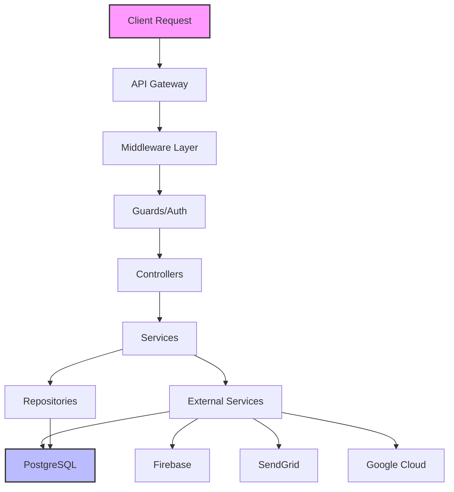

# SponsPay API - System Patterns

## Architecture Overview



## NestJS Module Architecture

### Module Organization
```typescript
@Module({
  imports: [
    ConfigModule.forRoot(),
    TypeOrmModule.forRoot(),
    AuthModule,
    UserModule,
    MarketingModule,
    MailModule,
    FileUploadModule,
  ],
  controllers: [AppController],
  providers: [AppService],
})
export class AppModule {}
```

### Feature Module Pattern
- Self-contained modules
- Clear boundaries
- Dependency injection
- Shared module for utilities

## Controller Patterns

### RESTful Design
```typescript
@Controller('marketing')
export class MarketingController {
  @Post('contactus')
  @UseGuards(ApiKeyGuard)
  @ApiSecurity('apiKey')
  async sendContactUsEmail(@Body() dto: ContactUsDTO) {
    return this.marketingService.processContactUsRequest(dto);
  }
}
```

### Standard Response Format
```typescript
{
  success: boolean;
  data?: any;
  error?: {
    code: string;
    message: string;
  };
  timestamp: string;
}
```

## Service Layer Patterns

### Business Logic Encapsulation
```typescript
@Injectable()
export class MarketingService {
  constructor(
    private readonly mailService: MailService,
    private readonly repository: Repository<ContactUs>,
  ) {}

  async processContactUsRequest(dto: ContactUsDTO) {
    // Validate
    // Transform
    // Save to database
    // Send email
    // Return response
  }
}
```

### Dependency Injection
- Constructor injection
- Interface-based design
- Testable services
- Loose coupling

## Authentication Patterns

### Multi-Strategy Authentication
```typescript
// API Key Strategy
@Injectable()
export class ApiKeyStrategy extends PassportStrategy(HeaderAPIKeyStrategy) {
  constructor(private apiKeyService: ApiKeyService) {
    super({ header: 'x-api-key' });
  }
}

// JWT Strategy
@Injectable()
export class JwtStrategy extends PassportStrategy(Strategy) {
  constructor(private firebaseService: FirebaseAdminService) {
    super();
  }
}
```

### Guard Implementation
```typescript
@Injectable()
export class JwtAuthGuard extends AuthGuard('jwt') {
  canActivate(context: ExecutionContext) {
    // Custom logic
    return super.canActivate(context);
  }
}
```

## Database Patterns

### Entity Design
```typescript
@Entity('users')
export class User {
  @PrimaryGeneratedColumn('uuid')
  id: string;

  @Column({ unique: true })
  email: string;

  @CreateDateColumn()
  createdAt: Date;

  @UpdateDateColumn()
  updatedAt: Date;
}
```

### Repository Pattern
```typescript
@Injectable()
export class UserService {
  constructor(
    @InjectRepository(User)
    private userRepository: Repository<User>,
  ) {}

  async findByEmail(email: string): Promise<User> {
    return this.userRepository.findOne({ where: { email } });
  }
}
```

## DTO Validation Pattern

### Input Validation
```typescript
export class ContactUsDTO {
  @IsEmail()
  @IsNotEmpty()
  email: string;

  @IsString()
  @MinLength(10)
  message: string;

  @IsPhoneNumber()
  @IsOptional()
  phone?: string;
}
```

### Transform Pipeline
```typescript
@UsePipes(new ValidationPipe({
  transform: true,
  whitelist: true,
  forbidNonWhitelisted: true,
}))
```

## Error Handling Patterns

### Custom Exceptions
```typescript
export class BusinessException extends HttpException {
  constructor(message: string, errorCode: string) {
    super({ message, errorCode }, HttpStatus.BAD_REQUEST);
  }
}
```

### Global Exception Filter
```typescript
@Catch()
export class AllExceptionsFilter implements ExceptionFilter {
  catch(exception: unknown, host: ArgumentsHost) {
    // Log error
    // Format response
    // Send to monitoring
  }
}
```

## External Service Integration

### Service Abstraction
```typescript
@Injectable()
export class SendGridService {
  private sgMail: any;

  constructor(configService: ConfigService) {
    this.sgMail = require('@sendgrid/mail');
    this.sgMail.setApiKey(configService.get('SENDGRID_API_KEY'));
  }

  async sendEmail(to: string, subject: string, html: string) {
    // Implementation with error handling
  }
}
```

### Circuit Breaker Pattern
- Retry logic
- Fallback mechanisms
- Timeout handling
- Error isolation

## Configuration Management

### Environment-Based Config
```typescript
export default () => ({
  database: {
    type: 'postgres',
    url: process.env.DATABASE_URL,
  },
  firebase: {
    projectId: process.env.FIREBASE_PROJECT_ID,
  },
  sendgrid: {
    apiKey: process.env.SENDGRID_API_KEY,
  },
});
```

### Config Validation
```typescript
const configValidationSchema = Joi.object({
  DATABASE_URL: Joi.string().required(),
  FIREBASE_PROJECT_ID: Joi.string().required(),
  SENDGRID_API_KEY: Joi.string().required(),
});
```

## Testing Patterns

### Property-Based Testing (fast-check)
- Purpose: validate logic over many randomized scenarios instead of a few hand-picked examples.
- When to use: correctness-sensitive logic (date bucketing, rounding, window boundaries, timezone offsets).
- Invariants commonly asserted:
  - series length equals requested days
  - dates contiguous and match local window startDate/endDate
  - per-day values are non-negative and rounded to 2 decimals
  - grand total equals the sum of per-day values
- Library: fast-check
- Current usage: Creator Insights revenue-per-day analytics (`src/creator-insights/creator-insights.service.property.spec.ts`)

Example (simplified):
```ts
await fc.assert(
  fc.asyncProperty(
    fc.integer({ min: 1, max: 60 }),                // days
    fc.integer({ min: -720, max: 840 }),            // tz offset
    fc.uniqueArray(fc.integer({ min: 0, max: 59 })),// day indexes
    async (days, tz, idxs) => {
      const result = await service.getRevenuePerDay('uid', days, tz);
      expect(result.series).toHaveLength(days);
      // ...assert contiguity, totals, rounding invariants...
    }
  ),
  { numRuns: 50 }
);
```

### Unit Test Structure
```typescript
describe('MarketingService', () => {
  let service: MarketingService;
  let mailService: jest.Mocked<MailService>;

  beforeEach(async () => {
    const module = await Test.createTestingModule({
      providers: [
        MarketingService,
        { provide: MailService, useValue: mockMailService },
      ],
    }).compile();
  });
});
```

### E2E Test Pattern
```typescript
describe('Marketing (e2e)', () => {
  it('/marketing/contactus (POST)', () => {
    return request(app.getHttpServer())
      .post('/marketing/contactus')
      .set('x-api-key', 'test-key')
      .send(contactUsDto)
      .expect(201);
  });
});
```

## Deterministic E2E Integration Testing Pattern

### When to use
- Any correctness-sensitive endpoint or workflow, including:
  - Time windowing, timezone offsets, date bucketing, and boundary logic
  - Monetary rounding, currency conversions, and totals aggregation
  - Multi-status pipelines and idempotent operations
  - Complex grouping/zero-fill logic or derived analytics

### Principles
- Freeze time deterministically in tests with `jest.spyOn(Date, 'now')`
- Ensure service code uses `Date.now()` (not `new Date()` directly for "now") so tests control the clock
- Run with a local Postgres (docker compose locally, Actions service in CI)
- Avoid external network calls by overriding guards/providers
- Seed data deterministically and atomically (single raw INSERT with explicit FKs, createdAt/updatedAt)
- Mirror service math in a test-side computeExpected helper to assert exact values, not just shapes

### Standard setup
1. Jest E2E config:
   - Add `setupFiles: ["<rootDir>/e2e.env.setup.ts"]`
   - Increase `testTimeout` (e.g., 30000)
   - Path mappers for `config/` and `src/` if needed

2. Env bootstrap file (`test/e2e.env.setup.ts`):
   - Provide DB_HOST/PORT/USER/PASSWORD/NAME and `DB_SYNC=true`
   - Provide safe dummy values for Firebase/Sendgrid/Zoho/Telegram/etc.
   - Set `NODE_ENV=test` and a non-conflicting `NODE_PORT`

3. Test module overrides:
   - Override `FirebaseAuthGuard`/`RolesGuard` to inject `req.user` with Creator role
   - Stub `FirebaseAdminService` and `TelegramClient` (and others if needed)

4. Time control:
   - `const nowSpy = jest.spyOn(Date, 'now').mockReturnValue(BASE_NOW_UTC.getTime());`
   - Restore in `afterAll`

5. Seeding:
   - Use `repository.query(...)` raw INSERT specifying:
     - amount, usdEstimatedValue
     - required columns (currencyId, beneficiaryId, payerFullName, payerPhone, paymentMethodId, statusId)
     - messageId, invoiceId, createdAt, updatedAt (explicit timestamps)

6. Assertions:
   - Build a fixed-length day series with zero-fill
   - Round per-day to 2 decimals, then round total to 2 decimals
   - Assert boundary behavior: start inclusive, end exclusive
   - Assert timezone shifts redistribute to neighboring days correctly
   - Keep a clear `computeExpected` that mirrors the service windowing/grouping logic

### CI integration
- GitHub Actions job `e2e`:
  - `services.postgres` with Postgres 16
  - DB env: `DB_HOST=127.0.0.1`, `DB_PORT=5432`, `DB_USER`, `DB_PASSWORD`, `DB_NAME`, `DB_SYNC=true`
  - Provide safe dummy envs for all required ConfigModule keys
  - Run `npm ci` and `npm run test:e2e`
- Ensure the e2e job runs in parallel with lint and unit tests; gate build/deploy on all three

### Example skeletons

E2E env setup (test/e2e.env.setup.ts):
```ts
process.env.NODE_ENV = 'test';
process.env.DB_HOST = 'localhost';
process.env.DB_PORT = '5432';
process.env.DB_USER = 'postgres';
process.env.DB_PASSWORD = 'postgres';
process.env.DB_NAME = 'postgres';
process.env.DB_SYNC = 'true';
// ...safe placeholders for SENDGRID, FIREBASE, TELEGRAM, ZOHO, etc.
```

Clock freeze and overrides:
```ts
let nowSpy: jest.SpyInstance<number, []>;
beforeAll(async () => {
  nowSpy = jest.spyOn(Date, 'now').mockReturnValue(new Date('2025-01-05T12:00:00Z').getTime());
  const moduleRef = await Test.createTestingModule({ imports: [AppModule] })
    .overrideGuard(FirebaseAuthGuard).useValue({ canActivate: () => { req.user = { user_id: 'uid', role: UserRole.Creator }; return true; }})
    .overrideGuard(RolesGuard).useValue({ canActivate: () => true })
    .overrideProvider(FirebaseAdminService).useValue({ verifyIdToken: jest.fn().mockResolvedValue(false) })
    .overrideProvider(TelegramClient).useValue({ connect: jest.fn(), disconnect: jest.fn() })
    .compile();
  app = moduleRef.createNestApplication();
  await app.init();
});
afterAll(async () => { await app?.close(); nowSpy?.mockRestore(); });
```

Seeding:
```ts
await repo.query(`
  INSERT INTO "transactions"
    ("amount","usdEstimatedValue","currencyId","messageId",
     "beneficiaryId","payerFullName","payerPhone","paymentMethodId","statusId",
     "invoiceId","createdAt","updatedAt")
  VALUES ($1,$2,$3,$4,$5,$6,$7,$8,$9,$10,$11,$11)
`, ['10.00','10.00',currencyId,messageId,beneficiaryId,'Test Payer','+100000000',providerId,statusId,null,'2025-01-05T10:00:00.000Z']);
```

## Performance Patterns

### Async Operations
- Promise-based services
- Concurrent processing
- Non-blocking I/O
- Stream processing

### Caching Strategy
```typescript
@Injectable()
export class CacheService {
  private cache = new Map();

  async get<T>(key: string): Promise<T> {
    return this.cache.get(key);
  }

  async set(key: string, value: any, ttl?: number) {
    this.cache.set(key, value);
    // TTL implementation
  }
}
```

## Security Patterns

### Input Sanitization
- DTO validation
- SQL injection prevention
- XSS protection
- Rate limiting

### Secrets Management
- Environment variables
- Kubernetes secrets
- Encrypted storage
- Rotation policies

## Monitoring Patterns

### Health Checks
```typescript
@Controller('health')
export class HealthController {
  @Get()
  @HealthCheck()
  check() {
    return this.health.check([
      () => this.db.pingCheck('database'),
      () => this.http.pingCheck('firebase', 'https://firebase.google.com'),
    ]);
  }
}
```

### Logging Strategy
- Structured logging
- Correlation IDs
- Log aggregation
- Error tracking

## Deployment Patterns

### Kustomize Architecture
```
k8s/
├── base/                    # Shared configuration
│   ├── deployment.yaml      # Base deployment
│   ├── service.yaml         # Base service
│   ├── backendconfig.yaml   # GCP health checks
│   └── kustomization.yaml   # Base kustomization
└── environments/
    ├── dev/                 # Development overlay
    │   ├── kustomization.yaml
    │   ├── deployment-patch.yaml
    │   ├── service-patch.yaml
    │   ├── ingress.yaml
    │   ├── managedcertificate.yaml
    │   └── namespace.yaml
    └── prod/                # Production overlay
        ├── kustomization.yaml
        ├── deployment-patch.yaml
        ├── service-patch.yaml
        ├── ingress.yaml
        ├── managedcertificate.yaml
        └── namespace.yaml
```

### Environment Isolation Pattern
```yaml
# Development Environment
namespace: sponspay-api-dev
domain: api-dev.sponspay.com
replicas: 1
resources: reduced
logging: debug

# Production Environment
namespace: sponspay-api-prod
domain: api.sponspay.com
replicas: 3
resources: optimized
logging: info
```

### Strategic Merge Patches
```yaml
# deployment-patch.yaml
apiVersion: apps/v1
kind: Deployment
metadata:
  name: sponspay-api
  namespace: sponspay-api-dev
spec:
  replicas: 1
  template:
    spec:
      containers:
      - name: api
        env:
        - name: NODE_ENV
          value: "development"
        resources:
          requests:
            memory: "128Mi"
            cpu: "50m"
```

### CI/CD Pipeline Pattern
```yaml
# Branch-based deployment
dev branch → Development environment
main branch → Production environment

# Pipeline steps:
1. Environment detection
2. Docker build & push
3. Kustomization update
4. Kubernetes deployment
5. Rollout monitoring
6. Status verification
```

### Container Security Pattern
```yaml
securityContext:
  allowPrivilegeEscalation: false
  runAsNonRoot: true
  runAsUser: 1000
  capabilities:
    drop:
    - ALL
```

### Health Check Integration
```yaml
# BackendConfig for GCP Load Balancer
apiVersion: cloud.google.com/v1
kind: BackendConfig
metadata:
  name: sponspay-api-config
spec:
  healthCheck:
    checkIntervalSec: 10
    timeoutSec: 5
    type: HTTP
    requestPath: /health
    port: 3000
```

### SSL Certificate Management
```yaml
# Google Managed Certificate
apiVersion: networking.gke.io/v1
kind: ManagedCertificate
metadata:
  name: dev-sponspay-api-cert
spec:
  domains:
  - api-dev.sponspay.com
```

## Telegram Integration Patterns

### Client Factory Pattern
```typescript
@Module({
  providers: [
    {
      provide: TelegramClient,
      useFactory: (configService: ConfigService) => {
        const apiId = parseInt(configService.get<string>('TELEGRAM_API_ID')!, 10);
        const apiHash = configService.get<string>('TELEGRAM_API_HASH')!;
        const session = configService.get<string>('TELEGRAM_SESSION_STRING')!;
        const stringSession = new StringSession(session);

        const client = new TelegramClient(stringSession, apiId, apiHash, {
          connectionRetries: 5,
          useWSS: true,
        });

        client.connect();
        return client;
      },
      inject: [ConfigService],
    },
  ],
})
```

### Service Abstraction Pattern
```typescript
@Injectable()
export class TelegramService {
  constructor(private readonly client: TelegramClient) {}

  async isChannelNameAvailable(username: string): Promise<boolean> {
    try {
      await this.client.invoke(new Api.contacts.ResolveUsername({ username }));
      return false; // Username exists
    } catch (error: any) {
      if (error.message.includes('USERNAME_NOT_OCCUPIED')) {
        return true; // Username available
      }
      this.logger.error(error);
      return false; // Error occurred, assume unavailable
    }
  }
}
```

### Error Handling Pattern
```typescript
// Telegram-specific error handling
try {
  const result = await this.telegramService.checkUsername(username);
  return result;
} catch (error) {
  if (error.message.includes('USERNAME_NOT_OCCUPIED')) {
    return true; // Counter-intuitive but correct
  }
  // Log and return safe default
  this.logger.error('Telegram API error:', error);
  return false;
}
```

### Testing Pattern
```typescript
describe('TelegramService', () => {
  const mockTelegramClient = {
    invoke: jest.fn(),
  };

  beforeEach(async () => {
    const module = await Test.createTestingModule({
      providers: [
        TelegramService,
        { provide: TelegramClient, useValue: mockTelegramClient },
      ],
    }).compile();
  });

  it('should return true if username is available', async () => {
    mockTelegramClient.invoke.mockRejectedValue(
      new Error('USERNAME_NOT_OCCUPIED')
    );
    const result = await service.isChannelNameAvailable('available_username');
    expect(result).toBe(true);
  });
});
```

## WebSocket Patterns (Socket.IO)

### Gateway Setup with Redis Adapter
```typescript
import { IoAdapter } from '@nestjs/platform-socket.io';
import { createAdapter } from '@socket.io/redis-adapter';
import { createClient } from 'redis';

@WebSocketGateway({
  namespace: 'telegram',
  cors: {
    origin: ['https://admin.socket.io', 'http://localhost:3000'],
    credentials: true,
  },
})
export class TelegramGateway implements OnGatewayConnection, OnGatewayDisconnect {
  @WebSocketServer()
  server: Server;

  async afterInit(server: Server) {
    const pubClient = createClient({ url: process.env.REDIS_URL });
    const subClient = pubClient.duplicate();
    await Promise.all([pubClient.connect(), subClient.connect()]);
    server.adapter(createAdapter(pubClient, subClient));
  }
}
```

### Room-Based Messaging Pattern
```typescript
// User-specific rooms for targeted messaging
@SubscribeMessage('joinUserRoom')
joinUserRoom(@ConnectedSocket() client: Socket, @MessageBody() firebaseUid: string) {
  const room = `user:${firebaseUid}`;
  client.join(room);
  this.logger.log(`Client ${client.id} joined room ${room}`);
}

// Emit to specific user (works across all pods with Redis adapter)
notifyCoAdminAdded(firebaseUid: string, channelHandle: string): void {
  this.server.to(`user:${firebaseUid}`).emit('coAdminAdded', {
    channelHandle,
    timestamp: new Date().toISOString(),
    status: 'success',
  });
}
```

### Multi-Pod WebSocket Scaling
```typescript
// Main.ts - Configure Socket.IO with Redis adapter
import { IoAdapter } from '@nestjs/platform-socket.io';
import { RedisIoAdapter } from './adapters/redis-io.adapter';

async function bootstrap() {
  const app = await NestFactory.create(AppModule);
  
  // Use Redis adapter for multi-pod scaling
  const redisIoAdapter = new RedisIoAdapter(app);
  await redisIoAdapter.connectToRedis();
  app.useWebSocketAdapter(redisIoAdapter);
  
  await app.listen(3000);
}
```

## Telegram Event-Driven Patterns

### Lifecycle Hooks for Event Listeners
```typescript
@Injectable()
export class TelegramService implements OnModuleInit, OnModuleDestroy {
  private eventHandler: ((event: NewMessageEvent) => Promise<void>) | null = null;
  
  async onModuleInit() {
    try {
      await this.client.connect();
      this.setupEventHandlers();
      this.logger.log('Telegram event handlers initialized');
    } catch (error: any) {
      this.logger.error('Failed to initialize Telegram service:', error?.message);
      // Don't throw - allow app to start even if Telegram connection fails
    }
  }
  
  async onModuleDestroy() {
    if (this.eventHandler !== null) {
      this.client.removeEventHandler(this.eventHandler, new NewMessage({}));
      this.eventHandler = null;
    }
  }
}
```

### Event-Driven Auto-Promotion Pattern
```typescript
private setupEventHandlers() {
  this.eventHandler = async (event: any) => {
    try {
      if (event instanceof Api.UpdateChannelParticipant) {
        const { channelId, newParticipant } = event;
        
        // Check if this is a new member join
        if (newParticipant?.className === 'ChannelParticipant') {
          const channel = await this.findChannelByTelegramId(channelId);
          
          if (channel && !channel.coAdminAdded && channel.inviteLink) {
            await this.promoteWithRetry(channel, userId);
          }
        }
      }
    } catch (error: any) {
      this.logger.error('Error processing Telegram event:', error?.message);
    }
  };
  
  this.client.addEventHandler(this.eventHandler, new Raw({}));
}
```

### Retry Pattern with Exponential Backoff
```typescript
private async promoteWithRetry(channel: TelegramChannel, userId: string): Promise<void> {
  const maxAttempts = 3;
  const delays = [1000, 5000, 15000]; // 1s, 5s, 15s

  for (let attempt = 1; attempt <= maxAttempts; attempt++) {
    try {
      await this.promoteToCoAdmin(channel, userId);
      
      // Notify via WebSocket on success
      if (channel.creator?.firebaseUid) {
        this.telegramGateway.notifyCoAdminAdded(
          channel.creator.firebaseUid,
          channel.channelHandle,
        );
      }
      return;
    } catch (error: any) {
      await this.updatePromotionAttempts(channel.id, attempt, error.message);
      
      if (attempt === maxAttempts) {
        // Send management alert on final failure
        await this.sendManagementAlert(channel, userId, error.message).catch(() => {});
        throw error;
      }
      
      await this.sleep(delays[attempt - 1]);
    }
  }
}

private sleep(ms: number): Promise<void> {
  return new Promise(resolve => setTimeout(resolve, ms));
}
```

### Self-Healing Pattern
```typescript
// Auto-generate missing invite links when accessed
async getChannelInviteInfo(firebaseUid: string) {
  const channel = await this.findChannel(firebaseUid);
  
  // Self-heal: generate invite link if missing
  if (!channel.inviteLink && channel.channelId) {
    try {
      const inviteResult = await this.client.invoke(
        new Api.messages.ExportChatInvite({
          peer: await this.resolveInputChannel(channel.channelId, channel.channelHandle),
          usageLimit: 1,
          title: 'Creator Invite',
        }),
      );
      
      if ('link' in inviteResult) {
        await this.updateInviteLink(channel.id, inviteResult.link);
        channel.inviteLink = inviteResult.link;
      }
    } catch (error: any) {
      this.logger.error('Failed to generate invite link:', error?.message);
    }
  }
  
  return {
    channelHandle: channel.channelHandle,
    inviteLink: channel.inviteLink || null,
    coAdminAdded: channel.coAdminAdded,
  };
}
