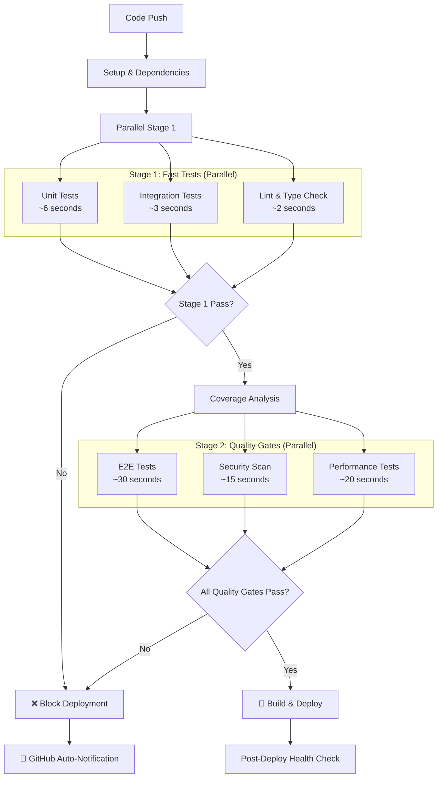

# Enhanced CI/CD Pipeline Documentation

## Overview

The SponsPay WebApp uses an enhanced CI/CD pipeline with comprehensive quality gates to ensure zero failed deployments and maintain high code quality standards. The pipeline leverages parallel execution for optimal performance and includes automated testing, security scanning, and performance validation.

## Pipeline Architecture



## Performance Metrics

### Sequential vs Parallel Execution

**Sequential Execution (Old):**
- Unit Tests: ~6 seconds
- Integration Tests: ~3 seconds  
- E2E Tests: ~30 seconds
- Security Scan: ~15 seconds
- Performance Tests: ~20 seconds
- **Total: ~74 seconds**

**Parallel Execution (New):**
- **Stage 1**: max(6, 3, 2) = ~6 seconds
- **Stage 2**: max(30, 15, 20) = ~30 seconds
- **Total: ~36 seconds (51% improvement!)**

### Complete Pipeline Timing

1. **Setup & Dependencies**: ~30 seconds
2. **Stage 1 (Parallel)**: ~6 seconds  
3. **Coverage Analysis**: ~5 seconds
4. **Stage 2 (Parallel)**: ~30 seconds
5. **Build & Deploy**: ~60 seconds
6. **Total Pipeline**: ~131 seconds (~2.2 minutes)

## Quality Gates

### 1. Unit Tests
- **Threshold**: 100% test success rate
- **Coverage Requirements**:
  - Statements: ≥80%
  - Branches: ≥75%
  - Functions: ≥90%
  - Lines: ≥80%
- **Execution**: Parallel with integration tests and linting
- **Blocking**: Yes - deployment stops if tests fail

### 2. Integration Tests
- **Scope**: Component interaction scenarios
- **Coverage**: Service integration, authentication flows
- **Execution**: Parallel with unit tests and linting
- **Blocking**: Yes - deployment stops if tests fail

### 3. E2E Tests
- **Framework**: Cypress
- **Coverage**: Critical user journeys (136+ tests)
- **Scenarios**: Landing page, auth flow, responsive design
- **Execution**: Parallel with security and performance tests
- **Blocking**: Yes - deployment stops if tests fail

### 4. Security Scanning
- **Tool**: npm audit
- **Threshold**: No high/critical vulnerabilities
- **Scope**: Production dependencies only
- **Execution**: Parallel with E2E and performance tests
- **Blocking**: Yes - high/critical vulnerabilities block deployment

### 5. Performance Testing
- **Tool**: Lighthouse CI
- **Threshold**: Performance score ≥95
- **Metrics**: Load time, bundle size, Core Web Vitals
- **Execution**: Parallel with E2E and security tests
- **Blocking**: Yes - performance below 95 blocks deployment

### 6. Coverage Analysis
- **Tool**: Custom coverage checker (`scripts/check-coverage.js`)
- **Thresholds**: See unit tests section above
- **Reporting**: Detailed breakdown with recommendations
- **Blocking**: Yes - coverage below thresholds blocks deployment

## Workflow Files

### Primary Workflow: `.github/workflows/enhanced-ci-cd.yml`

**Triggers:**
- Push to `main` or `dev` branches
- Manual workflow dispatch
- Ignores documentation, memory-bank, and configuration files

**Jobs:**
1. **setup**: Dependency installation and caching
2. **fast-tests**: Unit, integration, and lint tests (parallel)
3. **quality-gates**: E2E, security, and performance tests (parallel)
4. **coverage-analysis**: Coverage threshold validation
5. **set-environment**: Environment variable configuration
6. **deploy**: Build and deploy to Kubernetes
7. **cleanup-on-failure**: Failure handling and notifications

### Legacy Workflow: `.github/workflows/ci.yaml`

**Status**: Maintained for compatibility
**Usage**: Basic build and deploy without quality gates
**Recommendation**: Migrate to enhanced pipeline

## Environment Configuration

### Development Environment
- **Branch**: `dev`
- **Namespace**: `sponspay-dev`
- **URL**: https://dev.sponspay.com
- **Image Tag**: `dev-{commit-sha}`

### Production Environment
- **Branch**: `main`
- **Namespace**: `sponspay-prod`
- **URL**: https://sponspay.com
- **Image Tag**: `prod-{commit-sha}`

## Scripts and Tools

### NPM Scripts

#### Testing Scripts
```bash
# Unit Tests
npm run test:ci                 # CI-optimized unit tests with coverage
npm run test:fast              # Fast unit tests without coverage
npm run test:coverage-check    # Unit tests + coverage threshold check

# Integration Tests
npm run test:integration       # Integration test suite

# E2E Tests
npm run cypress:test:ci        # CI-optimized E2E tests
npm run cypress:test:responsive # Cross-device E2E tests

# Performance Tests
npm run lighthouse:ci          # Lighthouse CI performance tests
npm run quality-gate          # Combined coverage + E2E validation
```

#### Development Scripts
```bash
# Coverage Analysis
npm run coverage:serve         # Serve HTML coverage report
node scripts/check-coverage.js # Manual coverage threshold check

# Performance Monitoring
npm run test:performance       # Performance test execution timing
npm run test:timing           # Detailed test timing analysis
```

### Custom Scripts

#### `scripts/check-coverage.js`
- **Purpose**: Validate coverage thresholds with detailed reporting
- **Features**: 
  - Colorized console output
  - Detailed recommendations for improvement
  - CI-friendly exit codes
  - Multiple coverage report location detection

#### `scripts/test-performance.js`
- **Purpose**: Monitor test execution performance
- **Features**:
  - Execution time tracking
  - Memory usage monitoring
  - Performance trend analysis
  - Bottleneck identification

#### `scripts/parallel-test.js`
- **Purpose**: Advanced parallel test execution
- **Features**:
  - Intelligent test suite batching
  - Configurable concurrency levels
  - Performance reporting
  - Error aggregation

## Configuration Files

### `lighthouserc.json`
```json
{
  "ci": {
    "assert": {
      "assertions": {
        "categories:performance": ["error", {"minScore": 0.95}],
        "categories:accessibility": ["error", {"minScore": 0.90}],
        "categories:best-practices": ["error", {"minScore": 0.90}],
        "categories:seo": ["error", {"minScore": 0.90}]
      }
    }
  }
}
```

### `karma.conf.js`
- **Coverage Thresholds**: Statements 80%, Branches 75%, Functions 90%, Lines 80%
- **CI Optimization**: ChromeHeadlessOptimized with performance flags
- **Concurrency**: 8 processes (10 in CI mode)
- **Environment Modes**: CI, Performance, Debug, Verbose

## Deployment Strategy

### Kubernetes Rolling Updates
- **Strategy**: Rolling update with zero downtime
- **Health Checks**: Pod readiness and liveness probes
- **Rollback**: Automatic on deployment failure (K8s handles this)
- **Monitoring**: Post-deploy health verification

### Image Management
- **Registry**: Google Artifact Registry
- **Tagging Strategy**:
  - `{environment}-{commit-sha}` (specific version)
  - `{environment}-latest` (latest version)
- **Cleanup**: Automatic old image cleanup (configured in GKE)

## Failure Handling

### Automatic Blocking
- **Unit Test Failures**: Immediate pipeline termination
- **Coverage Below Thresholds**: Deployment blocked with detailed report
- **E2E Test Failures**: Screenshots and videos preserved as artifacts
- **Security Vulnerabilities**: High/critical vulnerabilities block deployment
- **Performance Issues**: Lighthouse score <95 blocks deployment

### Notifications
- **GitHub**: Automatic email notifications to repository watchers
- **Artifacts**: Test reports, screenshots, and performance data preserved
- **Logs**: Detailed failure information in GitHub Actions logs

### Recovery Process
1. **Identify Issue**: Check GitHub Actions logs and artifacts
2. **Fix Code**: Address the specific failure (tests, security, performance)
3. **Local Validation**: Run relevant scripts locally to verify fix
4. **Re-deploy**: Push fix to trigger new pipeline execution

## Monitoring and Metrics

### Pipeline Health
- **Success Rate**: Target 100% (zero failed deployments)
- **Execution Time**: Target <3 minutes total pipeline time
- **Test Coverage**: Maintain >80% across all metrics
- **Performance Score**: Maintain >95 Lighthouse score

### Quality Metrics
- **Test Count**: 824+ unit tests, 46+ integration tests, 136+ E2E tests
- **Security**: Zero high/critical vulnerabilities
- **Performance**: <2s load time, >95 Lighthouse score
- **Accessibility**: >90 accessibility score

## Best Practices

### For Developers

#### Before Pushing Code
```bash
# Run local quality checks
npm run test:coverage-check    # Verify coverage thresholds
npm run cypress:test:ci       # Run E2E tests locally
npm audit --audit-level=high  # Check for security issues
```

#### Writing Tests
- **Unit Tests**: Focus on business logic and edge cases
- **Integration Tests**: Test component interactions and service coordination
- **E2E Tests**: Cover critical user journeys and cross-browser compatibility

#### Performance Optimization
- **Bundle Analysis**: Use `npm run analyze` to identify large dependencies
- **Lazy Loading**: Implement route-based code splitting
- **Image Optimization**: Compress and optimize all images

### For CI/CD Maintenance

#### Regular Tasks
- **Dependency Updates**: Keep testing tools and browsers updated
- **Threshold Review**: Adjust coverage and performance thresholds as needed
- **Pipeline Optimization**: Monitor execution times and optimize bottlenecks

#### Troubleshooting
- **Flaky Tests**: Identify and fix unreliable tests immediately
- **Performance Degradation**: Monitor Lighthouse scores and investigate drops
- **Security Alerts**: Address dependency vulnerabilities promptly

## Migration Guide

### From Legacy CI to Enhanced Pipeline

1. **Enable Enhanced Pipeline**:
   ```bash
   # The enhanced pipeline is already active
   # Legacy pipeline remains for compatibility
   ```

2. **Verify Quality Gates**:
   ```bash
   # Test coverage thresholds
   npm run test:coverage-check
   
   # E2E test execution
   npm run cypress:test:ci
   
   # Performance validation
   npm run lighthouse:ci
   ```

3. **Monitor First Deployment**:
   - Watch GitHub Actions for any failures
   - Verify all quality gates pass
   - Confirm successful deployment to target environment

### Rollback Plan
If issues arise with the enhanced pipeline:

1. **Disable Enhanced Workflow**: Rename `.github/workflows/enhanced-ci-cd.yml` to `.disabled`
2. **Use Legacy Workflow**: The existing `ci.yaml` will continue to work
3. **Fix Issues**: Address any problems with the enhanced pipeline
4. **Re-enable**: Rename back to `.yml` to reactivate enhanced pipeline

## Support and Troubleshooting

### Common Issues

#### Coverage Threshold Failures
```bash
# Generate detailed coverage report
npm run test:coverage
npm run coverage:serve

# Check specific threshold failures
node scripts/check-coverage.js
```

#### E2E Test Failures
```bash
# Run specific test suites
npm run cypress:test:landing
npm run cypress:test:auth

# Debug with browser UI
npm run cypress:open
```

#### Performance Issues
```bash
# Local performance testing
npm run lighthouse:collect
npm run lighthouse:assert

# Bundle analysis
npm run analyze
```

### Getting Help

1. **Check Logs**: GitHub Actions provides detailed execution logs
2. **Review Artifacts**: Download test reports and screenshots from failed runs
3. **Local Reproduction**: Use the same scripts locally to reproduce issues
4. **Documentation**: Refer to this guide and individual tool documentation

## Future Enhancements

### Planned Improvements
- **Cross-Browser E2E Testing**: Expand to Firefox and Safari
- **Visual Regression Testing**: Add screenshot comparison tests
- **Performance Budgets**: Set specific bundle size limits
- **Accessibility Testing**: Enhanced a11y validation
- **Security Scanning**: Add SAST (Static Application Security Testing)

### Monitoring Enhancements
- **Dashboard**: Create pipeline health dashboard
- **Alerts**: Set up proactive failure notifications
- **Metrics**: Track pipeline performance trends over time
- **Reporting**: Generate weekly quality reports

---

**Last Updated**: December 2024  
**Version**: 1.0  
**Maintainer**: SponsPay Development Team
