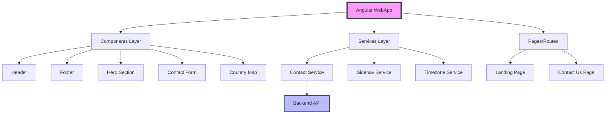

# SponsPay WebApp - System Patterns

## Architecture Overview



## Component Architecture

### Smart vs Presentational Components
- **Smart Components** (Pages): Handle business logic and data flow
  - `landing-page.component.ts`
  - `contact-us.component.ts`
- **Presentational Components**: Focus on UI rendering
  - `header.component.ts`
  - `footer.component.ts`
  - `hero-section.component.ts`

### Component Communication
- **Input/Output Decorators**: Parent-child communication
- **Services**: Cross-component state management
- **RxJS Observables**: Async data streams

## Service Layer Patterns

### API Communication
```typescript
// Standardized service pattern
export class ContactUsService {
  constructor(private http: HttpClient) {}
  
  submitContactForm(data: ContactFormData): Observable<Response> {
    return this.http.post<Response>(`${environment.apiUrl}/marketing/contactus`, data);
  }
}
```

### State Management
- Local component state for UI interactions
- Service-based state for shared data
- No global state management library (keeping it simple)

## Routing Architecture

### Route Configuration
```typescript
export const routes: Routes = [
  { path: '', component: LandingPageComponent },
  { path: 'contact', component: ContactUsComponent },
  { path: '**', redirectTo: '' }
];
```

### Lazy Loading Strategy
- Currently using eager loading
- Prepared for lazy loading as app grows

## Styling Patterns

### SCSS Organization
```scss
// Theme structure
src/theme/
  _variables.scss    // Global variables
  _mixins.scss      // Reusable mixins
  
// Component styles
- Scoped to components
- BEM-like naming conventions
- Bootstrap utility classes
```

### Responsive Design
- Mobile-first approach
- Bootstrap grid system
- Custom breakpoints in _variables.scss

## Form Handling

### Reactive Forms Pattern
- Form validation at component level
- Custom validators for phone numbers
- Error message display strategy
- Toast notifications for feedback

## HTTP Interceptor Pattern

### Authentication Headers
```typescript
// Automatic API key injection
export class HeaderTokenInterceptor implements HttpInterceptor {
  intercept(req: HttpRequest<any>, next: HttpHandler): Observable<HttpEvent<any>> {
    const authReq = req.clone({
      headers: req.headers.set('api-key', environment.apiKey)
    });
    return next.handle(authReq);
  }
}
```

## Asset Management

### SVG Icon System
- Centralized icon definitions in `svg-icons.ts`
- Type-safe icon references
- Optimized SVG loading

### Image Optimization
- Separate public/images directory
- Lazy loading for below-fold images
- SVG for scalable graphics

## Error Handling

### Global Error Strategy
- HTTP error interceptor
- User-friendly error messages
- Toast notifications for errors
- Console logging in development

## Security Patterns

### API Security
- API key authentication
- Environment-based configuration
- No sensitive data in frontend

### Input Validation
- Client-side validation
- Sanitization before API calls
- XSS prevention through Angular

## Performance Patterns

### Bundle Optimization
- Tree shaking enabled
- Production build optimizations
- Code splitting preparation
- Asset preloading

### Change Detection
- Default change detection strategy
- OnPush strategy for static components
- Async pipe for observables

## Testing Patterns

### Unit Testing (Enhanced CI/CD Integration)
- **Jasmine/Karma setup** with coverage thresholds enforcement
- **Component isolation** with comprehensive mocking strategies
- **Service mocking** using dedicated testing utilities in `src/testing/mocks/`
- **Test-driven development** with mandatory coverage requirements
- **Coverage Thresholds**: 80% statements, 75% branches, 90% functions, 80% lines
- **Pipeline Integration**: `npm run test:coverage` must pass for deployment

### Integration Testing
- **Cross-component testing** for feature interactions
- **Service integration** testing for API communication
- **Authentication flow** testing for complete user journeys
- **Mock data coordination** between components
- **Pipeline Integration**: `npm run test:integration` validates component interactions

### End-to-End Testing (Cypress)
- **Parallel execution** across 5 test specifications
- **User journey coverage**: Landing page, auth flow, responsive design
- **Performance testing**: Basic performance assertions in E2E tests
- **Accessibility testing**: ARIA compliance and keyboard navigation
- **Cross-browser compatibility**: Headless Chrome for CI environment
- **Pipeline Integration**: All Cypress tests must pass for deployment

### Testing Infrastructure
```typescript
// Comprehensive testing utilities pattern
src/testing/
├── mocks/           // Service mocks and test doubles
├── fixtures/        // Test data and scenarios
└── helpers/         // Testing utility functions

src/app/testing/
└── integration-helpers.ts  // Cross-component testing utilities
```

### Coverage Exclusion Strategy
```typescript
// Angular.json configuration for accurate coverage measurement
"codeCoverageExclude": [
  "src/testing/**/*",           // Testing infrastructure
  "src/app/testing/**/*",       // Integration helpers
  "src/environments/environment*.ts",  // Firebase config
  "src/app/app.config.ts"       // Firebase initialization
]
```

## Deployment Patterns

### Environment Management
- Separate environment files
- Build-time configuration
- No runtime environment switching

### Container Strategy
- Multi-stage Docker builds
- Nginx for static serving
- Kubernetes-ready configuration

## Monitoring Patterns

### Logging Strategy
- Structured logging with context
- Different log levels for different environments
- No sensitive data in logs

## Integration Patterns

### Backend API Integration
1. **Service Layer**: Clean abstraction for API calls
2. **Error Handling**: Graceful degradation when API is unavailable
3. **Authentication**: Automatic API key injection via interceptors
4. **Type Safety**: Strong typing for all API responses
5. **Environment Configuration**: API endpoints configured per environment

### Firebase Authentication Integration
1. **Angular Fire Integration**: Uses Angular Fire's native `authState()` observable for reactive user state management
2. **Environment-Specific Configuration**: Firebase `authDomain` configured per environment (dev.sponspay.com, sponspay.com, localhost)
3. **Redirect Flow Pattern**: Uses `signInWithRedirect()` instead of popup to avoid COOP policy issues
4. **Single Redirect Processing**: Processes `getRedirectResult()` only once in service constructor to prevent consuming results multiple times
5. **Reactive Authentication**: Components subscribe to user$ and channelStatus$ observables for automatic UI updates
6. **Session Storage Integration**: Uses SessionStorageService for persisting authentication state across redirects
7. **YouTube API Integration**: Automatically checks for YouTube channels and fetches analytics data post-authentication

### Authentication Service Pattern
```typescript
// Proper Angular Fire implementation
export class AuthService {
  // Use Angular Fire's authState directly
  public user$ = authState(this.auth);
  
  // Process redirect result only once
  private async processRedirectResult() {
    const result = await getRedirectResult(this.auth);
    if (result && !this.redirectResultProcessed) {
      this.redirectResultProcessed = true;
      // Process tokens and channel status
    }
  }
}
```

### Authentication Flow Service Pattern
```typescript
// Orchestrates complete authentication workflows
export class AuthFlowService {
  // Single entry point for revenue estimator flow
  async initiateRevenueEstimatorFlow(): Promise<void> {
    // Check existing auth state
    // Handle authentication if needed
    // Open modal with proper data
  }
  
  // Handles post-redirect authentication
  async handlePostRedirectFlow(user: User): Promise<void> {
    // Process session storage flags
    // Coordinate with AuthService
    // Open appropriate modals
  }
  
  // Environment-aware authentication
  private async initiateAuthentication(): Promise<void> {
    // Popup for localhost
    // Redirect for production
  }
}
```

### Clean Component Pattern
```typescript
// Simplified UI components with single responsibility
export class HeroSectionComponent {
  private authFlowService = inject(AuthFlowService);
  
  // Single method delegates to service
  async openRevenueEstimatorModal(): Promise<void> {
    await this.authFlowService.initiateRevenueEstimatorFlow();
  }
}
```

### Session Storage Service Pattern
```typescript
// Type-safe session storage with browser compatibility
export class SessionStorageService {
  setBooleanItem(key: string, value: boolean): void {
    this.setItem(key, value.toString());
  }
  
  getBooleanItem(key: string): boolean | null {
    const value = this.getItem(key);
    if (value === null) return null;
    return value === 'true';
  }
  
  setObjectItem<T>(key: string, value: T): void {
    this.setItem(key, JSON.stringify(value));
  }
  
  getObjectItem<T>(key: string): T | null {
    const value = this.getItem(key);
    return value ? JSON.parse(value) as T : null;
  }
}
```

### Cross-Component Communication
```typescript
// App component listens to auth state changes
this.authService.user$.subscribe(async (user) => {
  const isPendingRevenueEstimator = this.storageService.getBooleanItem('pendingRevenueEstimator');
  
  if (user && isPendingRevenueEstimator) {
    // React to channel status changes
    this.authService.channelStatus$.subscribe((status) => {
      if (status !== 'unknown') {
        this.openRevenueEstimatorModal(user, status === 'found');
      }
    });
  }
});
```

### Authentication Flow with Session Storage
1. **Pre-Authentication**: Hero section sets `pendingRevenueEstimator` flag in session storage
2. **Redirect**: User redirected to Google OAuth
3. **Post-Authentication**: App component checks session storage flag and opens modal
4. **Cleanup**: Session storage flag cleared after processing
